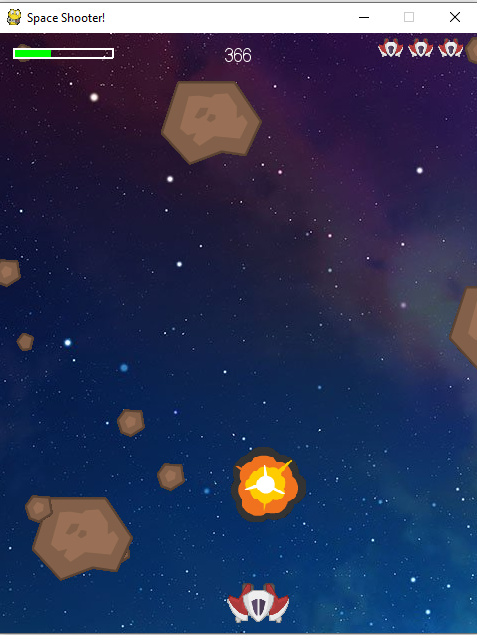
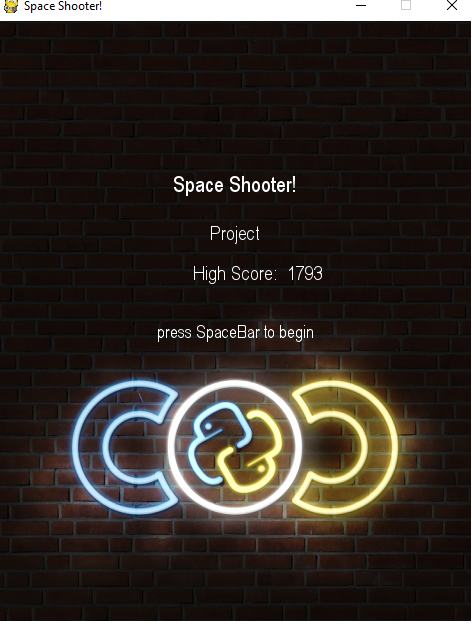
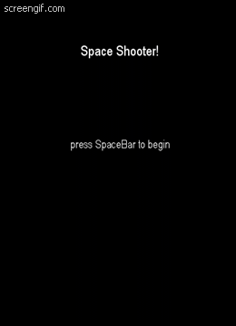

# Space-Shooter-Game
A fun game developed with [Pygame] library.

## How to play
Simply install Pygame library with this command
### `pip install pygame`
and then run the Space Shooter.py file.

## Visuals

  
  
  

https://user-images.githubusercontent.com/51258896/119983415-5d593a00-bfd5-11eb-86ef-faca76780de3.mp4

[Pygame]: <https://www.pygame.org>
